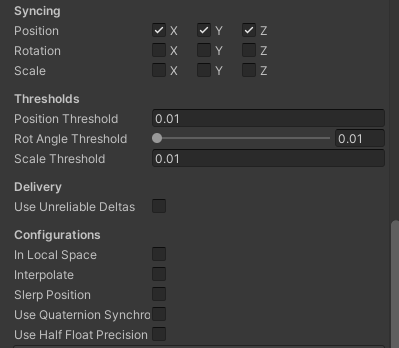

# **Informe Netcode**

## **Netcode Authorities**

### **Server Authority**
Al utilizar el server authority se percibe un delay importante en el lado del cliente que puede resultar molesto o desventajoso en caso de usarse en un juego competitivo, yo solo lo usaría en videojuegos poco dinámicos, con muchas reestricciones de servidor y que necesiten un mayor grado de seguridad de red.
____
### **Server Authority con Rewind**
Muy similar al **Server Authority** pero se aprecia mucho menos el delay en el lado del cliente, este creo que ya podría utilizarse en una mayor variedad de juegos.
____

### **Client Authority**
Este es el que va a preferir el cliente en la gran mayoría de casos, con una escasa diferencia de fluidez en cuanto al host (en caso de haberlo y no ser servidor), pero pese a sentirse mucho mejor a las otras opciones, flaquea en los aspectos de seguridad. 

Al no comprobar realmente las acciones del cliente en la mayoría de casos, el juego tiene mayor vulnerabilidad a modificaciones que pueden dar ventaja a quien las use de una forma injusta.

Por lo cuál esta versión la utilizaria en videojuegos cooperativos o con servidores privados hosteables, hacer un juego competitivo con este sistema en mi opinión sería problemático y se debería optar a algo híbrido entre servidor y cliente.   

____

## **Interpolación**
La interpolación es un tema bastante delicado según las pruebas que he realizado, debido a que supuestamente su función es ayudar al cliente a ver un movimiento medianamente natural sin comprobar en todo momento su posición hasta la ubicación a donde se desplaza.

Pero realmente al desactivarla (*En Netcode for GameObjects al menos*) el movimiento del cliente se siente muchisimo más fluido y natural eliminando una enorme cantidad de delay.

